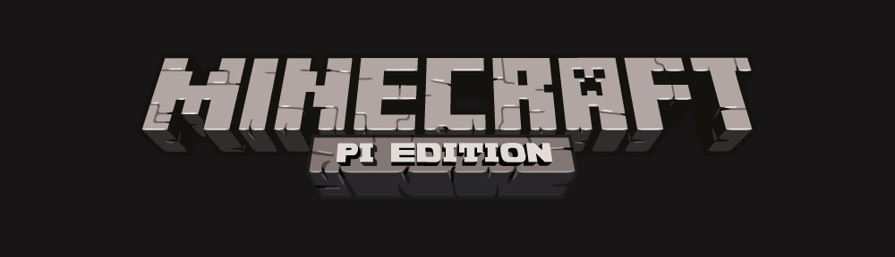

= Minecraft - Pi Edition

Minecraft – Pi Edition runs on Raspbian “wheezy” with XWindows. If you
need to set that up, visit http://www.raspberrypi.org/downloads and
follow the detailed instructions within.  

. Boot up your Raspberry Pi with Raspbian. 
. If you haven’t set XWindows to start automatically upon boot,
  type in “startx”.  
. Next click the icon for LXTerminal to open a new terminal window. 
. Use the following commands (in bold) to download and
  launch:

----
$ wget https://s3.amazonaws.com/assets.minecraft.net/pi/minecraft-pi-0.1.1.tar.gz
$ tar -zxvf minecraft-pi-0.1.1.tar.gz
$ cd mcpi
$ ./pinecraft-pi
----
