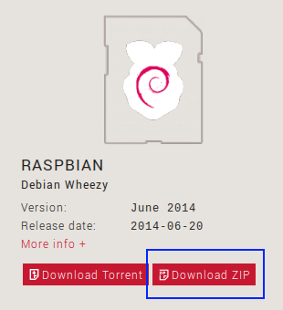
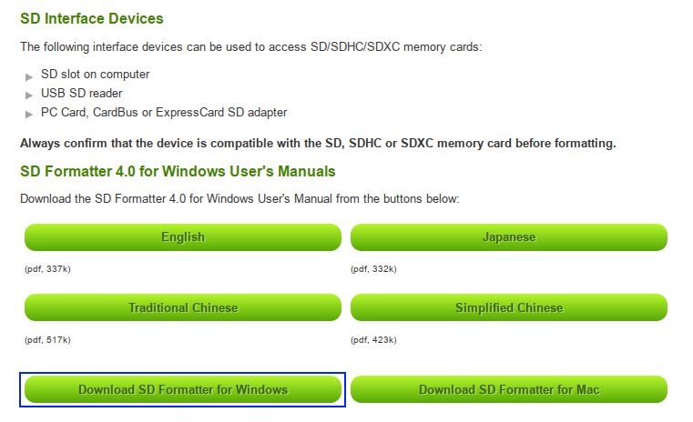
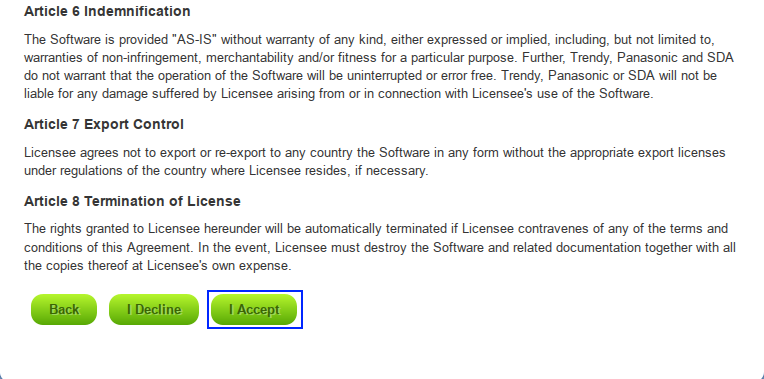

= Scratch for Raspberry Pi Setup

. Write Raspbian image onto SD card (SD card minimum size: 4GB)
.. Go to http://www.raspberrypi.org/downloads
.. Scroll down to find the download link for `Raspbian`. 

.. Insert your SD card into your computer
.. Go to https://www.sdcard.org/downloads/formatter_4/ and click either
   _Download SD Formatter for Windows_ or _Download SD Formatter for Mac_
   dependent upon the OS you use. Agree to the terms and conditions to
   download the installer. Once downloaded install the SD card
   formatter and open it up.

