# Resources

This folder contains a collection of useful resources. In particular, resources for coming up with ideas or making stuff.

## Inspirational

##### [3D Printed Dress](http://www.instructables.com/id/JOIN-OUR-OPEN-SOURCE-ELEMENT-DRESS/)

##### [3D Printed Jewelry](http://www.instructables.com/id/3D-Printed-Audio-Jewelry/)

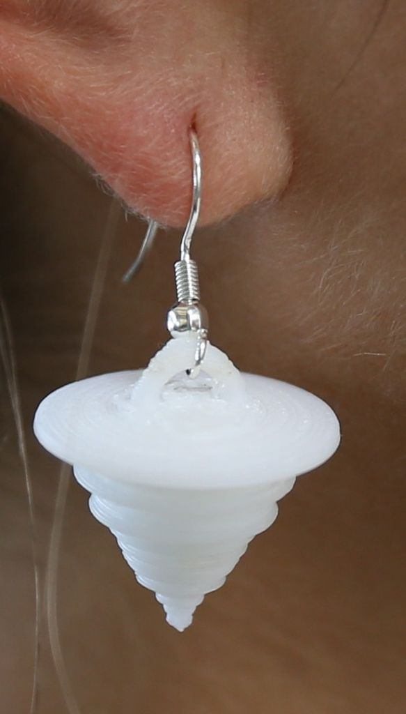

##### [A Kit of Things](http://www.plusea.at/?p=1855)

[Thesis PDF](http://hlt.media.mit.edu/publications/hannahMSthesis.pdf)
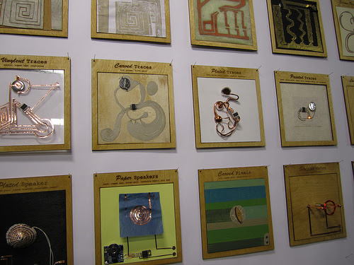

##### [Breadboard Pincushion](http://www.kobakant.at/DIY/?p=3106)

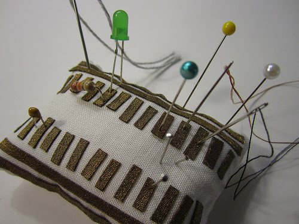

##### [Embroidered Speaker](http://www.kobakant.at/DIY/?p=3652)

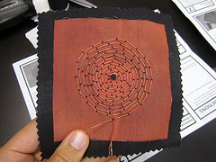

##### Hand Made Sensors

[Link 1](http://www.plusea.at/?p=4203)
[Link 2](http://www.plusea.at/?p=2779)
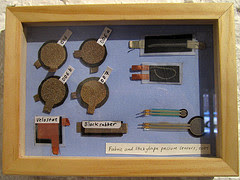
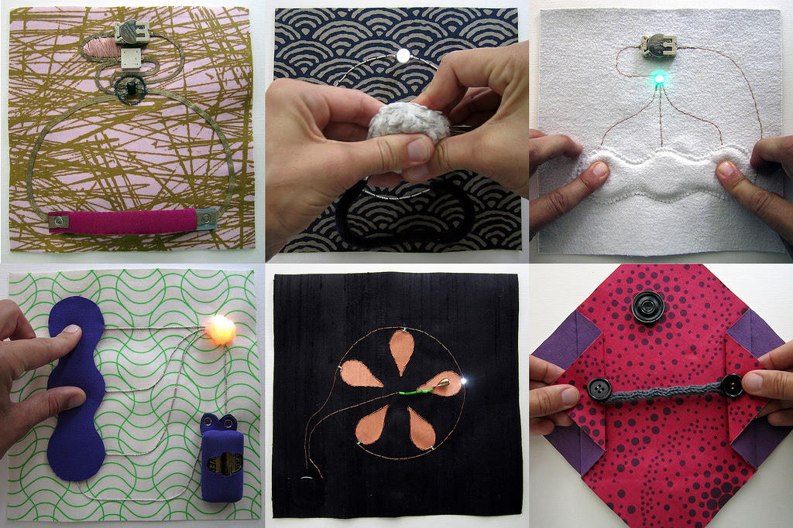

##### [LED Bracelet](http://www.plusea.at/?p=515)

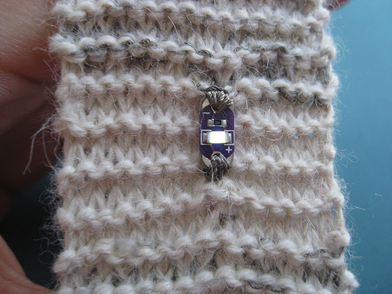

##### [Potentiometer Bracelet](http://www.plusea.at/?p=515)

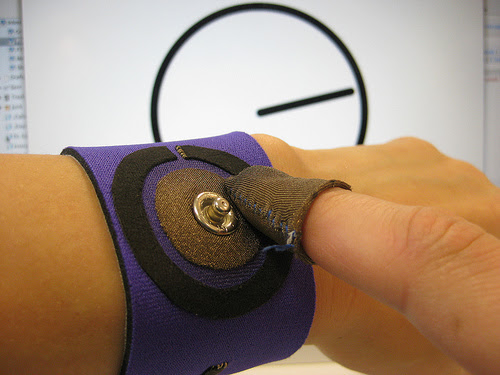

##### [LED Necklace](http://www.plusea.at/?p=4175)

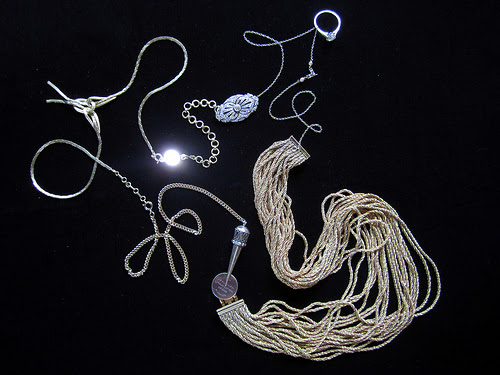

##### [Limpet Push Button](http://www.plusea.at/?p=159)

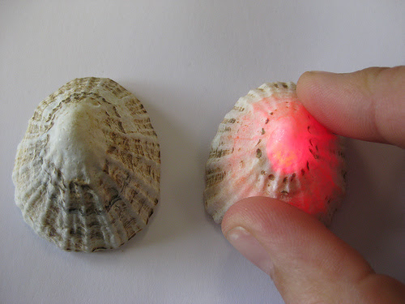

##### [Paper Piano](http://www.plusea.at/?p=1069)

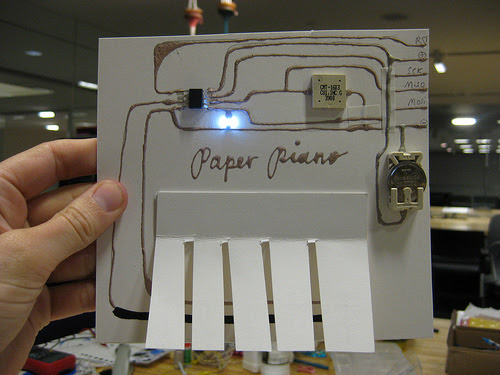

##### [T-Shirt Piano](http://www.plusea.at/?p=1082)

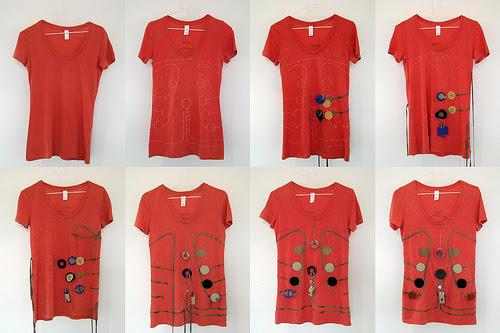

## Technical

### Raspberry Pi

* [Cambridge RPi tutorials](http://www.cl.cam.ac.uk/projects/raspberrypi/tutorials/) (temperature sensor, OS dev, turing machines, image processing, distributed computing)
* [Cymplecy (simplesi)](http://cymplecy.wordpress.com/), wonderful RPi tutorials written by a primary school ICT teacher, lots of good scratch resources
* [ScratchGPIO](http://cymplecy.wordpress.com/scratchgpio/)
* [ScratchGPIO source](https://github.com/cymplecy/scratch_gpio)

### Arduino

* [Ardublock](http://blog.ardublock.com/), graphical programming language.
* [Temboo](https://www.temboo.com/library/), library with wrapper around loads of interesting websites (e.g. Twitter, FB, Gmail, EC2, Twilio, google docs)
* [Firmata](http://www.firmata.org/wiki/Main_Page), sketch for the arduino allowing easy interfacing with computers, e.g. reading analog inputs from a Processing sketch for a pong-like game

### APIs
#### Analysis

* [Alchemy - Text analysis](http://www.alchemyapi.com/) (Will has
  used/recommends it)
* [Ingenia - Text analysis](https://www.ingeniapi.com/)

#### Communication

* [Twilio](https://www.twilio.com/) - Programmatically send SMS and calls.

### Storage

* [mongoDB - key value database](http://www.mongodb.org/)

* [MySQL - one of the most widely used SQL databases](http://www.mysql.com/) ORMs: Object Relational Mappings abstract persistence, so rather than having something that generates the SQL to store. You may also want to look into OGMs, very similar to ORMs but use NoSQL datastores instead.
* [Hibernate - Java ORM and OGM](http://hibernate.org/)
* [SQLAlchemy - Python ORM (datamapper)](http://www.sqlalchemy.org/)
* [MongoAlchemy - Python OGM](http://www.mongoalchemy.org/)

### Data

* [Mapquest geocoding](http://data.gov.uk/)
- [Match an address with a Lat and Lon](http://developer.mapquest.com/web/products/dev-services/geocoding-ws))

### General

* [Temboo](https://www.temboo.com/library/) : Library with wrapper around loads of interesting websites (e.g. Twitter, FB, Gmail, EC2, Twilio, google docs)

### Front-end

#### Build-tools

* [Yeoman](http://yeoman.io/), project scaffolding. If you're making anything web based, *you need this* (by need, it's very much worth your while checking out).
* [Grunt](http://gruntjs.com/), js task runner, think of it as Make for the frontend
* [Gulp](http://gulpjs.com/), Similar to Grunt, but uses Node streams to pass along file data to modify.
* [{less}](http://lesscss.org/), CSS preprocessor - makes working with CSS marginally less painful.
* [Sass](http://sass-lang.com/), as above, but an alternative
* [Stylus](http://learnboost.github.io/stylus/), yes, yet another CSS preprocessor

#### Boilerplate

* [HTML5 Boilerplate](http://html5boilerplate.com/), Boilerplate for an HTML5 application (includes jQuery and Modernizr).
* [jQuery](http://jquery.com/), Like the standard library of js on the web.
* [jQuery mobile](http://jquerymobile.com/), UI system optimized for touch interfaces
* [jQuery UI](http://jqueryui.com/), UI widgets for the web
* [Twitter Bootstrap](http://getbootstrap.com/), UI framework
* [Compass](http://compass-style.org/), CSS authoring framework; think of it as a library of prewritten CSS snippets that insulate you from cross-browser quirks, provide you with grips, list styles, and a whole bunch of other aesthetic things

#### Mapping

* [Leaflet - Pretty, works with D3](http://leafletjs.com/)

#### Data visualisation

* [D3.js](http://d3js.org/), Manipulate the DOM in beautiful ways

## Wearables Components

# Products to test

Let's buy some of these to evaluate. I (Will) plan to put together little demos demonstrating what is possible with combinations of sensors and outputs to show teachers when they come in to show them what is possible and give them ideas for what might make a successful workshop.

##### Vibe-motor

https://www.coolcomponents.co.uk/lilypad-vibe-board.html, vibration motor, interesting form of feedback from sensors.

##### Temperature-sensor

https://www.coolcomponents.co.uk/lilypad-temperature-sensor.html, temperature sensor.

##### SquareWear

https://www.coolcomponents.co.uk/squarewear-v2-0-wearable-arduino.html,

This is the board that David of http://www.electronicfashion.co.uk/ uses in addition to the Arduino Gemma.

##### Resistive-rubber

https://www.coolcomponents.co.uk/conductive-rubber-cord-stretch-sensor-extras.html, Rubber cord that can sense how much it's being stretched.

##### led-strip

https://www.coolcomponents.co.uk/36mm-square-12v-digital-rgb-led-pixels-strand-of-20-ws2801.html, 20 LEDs on a strip that can be cut up and used individually, this would be quite appropriate for sewing, and they're RGB, meaning that you can choose any colour you like.

##### Pressure-sensitive-sheet

https://www.coolcomponents.co.uk/pressure-sensitive-conductive-sheet-velostat-linqstat.html, pressure sensitive condutive sheet.

##### coin-cell-holder

http://proto-pic.co.uk/coin-cell-holder-sewable-smd/, Coin cell holder for Gemma board

##### microphone-adapter

http://proto-pic.co.uk/breakout-board-for-electret-microphone/ and http://proto-pic.co.uk/electret-microphone/ can be used to take audio inputs

#####

http://www.mindsetsonline.co.uk/Catalogue/ProductDetail/electrotextiles-sample-pack?productID=8fe0a253-ee0a-4ad9-877b-04c7f3b68835&catalogueLevelItemID=dd45e5bd-734f-408a-a80d-ba436acf6563, Collection of Electrotextiles that will be useful to evaluate.

##### muscle-wire

http://www.technologysupplies.co.uk/muscle-wire-100um-dia-1m.html or http://proto-pic.co.uk/muscle-wire-0-012-diameter-1-foot/, Muscle wire, contracts when you apply a voltage over it, very cool!

## Expensive, but interesting

These look quite cool, and could probably be used to good effect in a demo to show what is possible with currently available materials/sensors, but they may not be appropriate for using in a workshop due to excessive cost(?).

##### Accelormeter

http://proto-pic.co.uk/lilypad-accelerometer-adxl335/, Accelerometer
